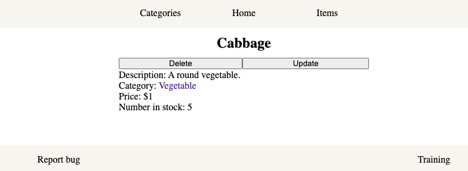

# inventory-application

An inventory system for a store.

    

## Features

- Uses Node, Express, Pug, SCSS, MongoDB, and Mongoose.
- Categories and items for those categories can be created, read, updated, and deleted.
- Pug and SCSS were used to familiarize myself with preprocessors.
- Data validation and sanitization.

## Demo

- https://immense-castle-68660.herokuapp.com/
